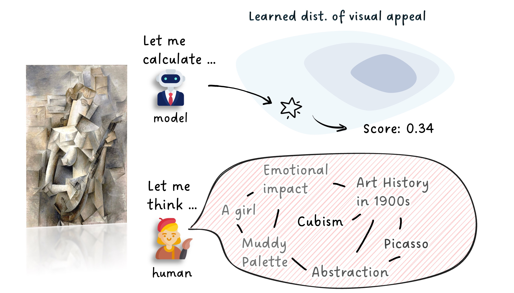

# 🎨 Multimodal LLMs Can Reason about Aesthetics in Zero-Shot | [Arxiv](https://arxiv.org/abs/2501.09012)
TL;DR :fire::fire:: Can MLLMs evaluate the aesthetics of artworks with inference-time reasoning? If so, how? We analyze these issues in this paper, revealing the challenges and offer a strong baseline technique that boost the MLLMs' alignment with human preference.

---
Abstract: The rapid progress of generative art has democratized the creation of visually pleasing imagery. However, achieving genuine artistic impact - the kind that resonates with viewers on a deeper, more meaningful level - requires a sophisticated aesthetic sensibility. This sensibility involves a multi-faceted reasoning process extending beyond mere visual appeal, which is often overlooked by current computational models. This paper pioneers an approach to capture this complex process by investigating how the reasoning capabilities of Multimodal LLMs (MLLMs) can be effectively elicited for aesthetic judgment. Our analysis reveals a critical challenge: MLLMs exhibit a tendency towards hallucinations during aesthetic reasoning, characterized by subjective opinions and unsubstantiated artistic interpretations. We further demonstrate that these limitations can be overcome by employing an evidence-based, objective reasoning process, as substantiated by our proposed baseline, ArtCoT. MLLMs prompted by this principle produce multi-faceted and in-depth aesthetic reasoning that aligns significantly better with human judgment. These findings have direct applications in areas such as AI art tutoring and as reward models for generative art. Ultimately, our work paves the way for AI systems that can truly understand, appreciate, and generate artworks that align with the sensible human aesthetic standard.

## Update
::fire::fire:: Jul 05: This work is accepted to ACM MM 2025!

## Dataset 

**The FineArtBench dataset will be available soon.**

--- 

## ArtCoT

We propose ArtCoT to enhance the inference-time reasoning capability of MLLMs. A example conversation is provided below. Detailed quantitative comparison can be found in [paper](https://arxiv.org/abs/2501.09012). The full response from MLLMs in our experiments will also be released to facilitate further research.

