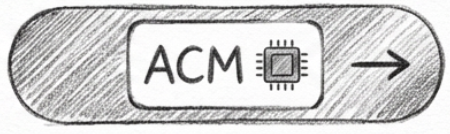
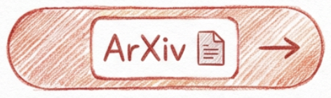
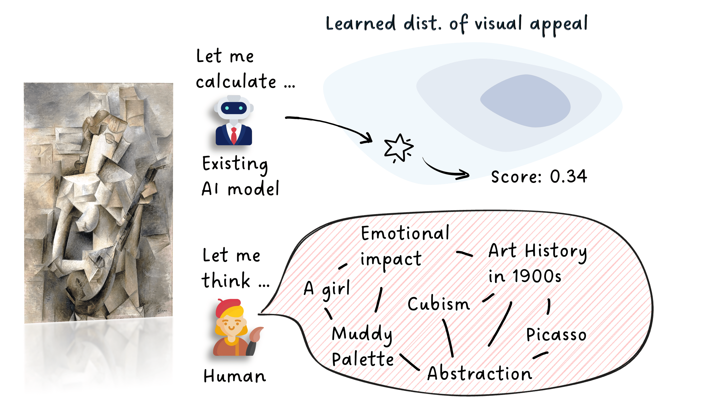
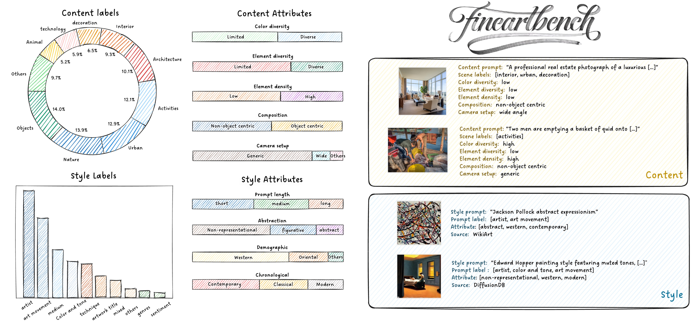
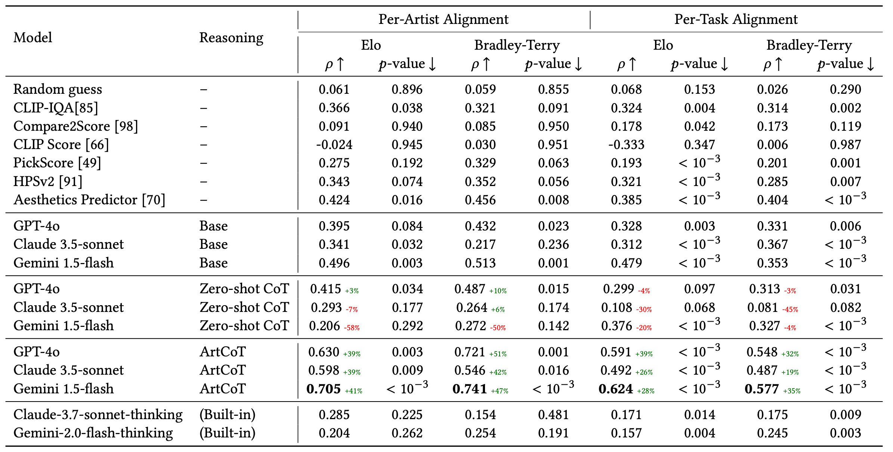
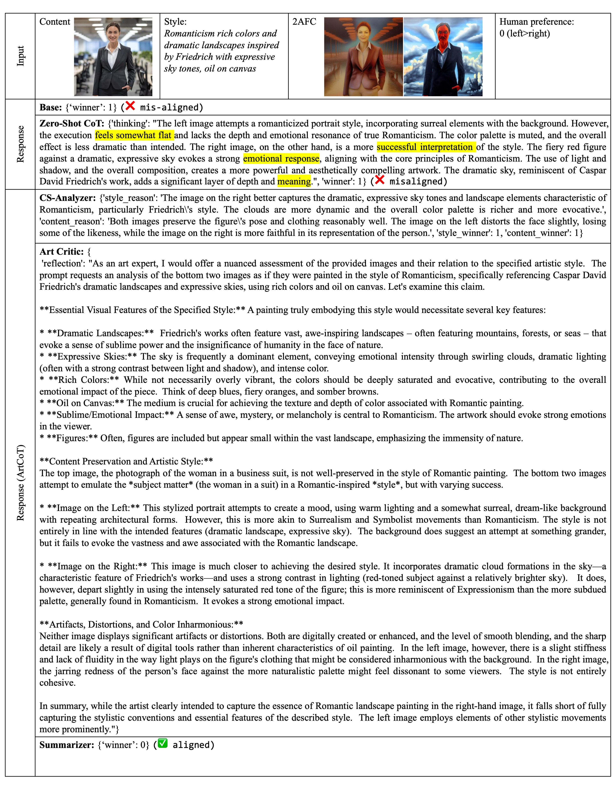

<h1 align="center">🎨 Multimodal LLMs Can Reason about Aesthetics in Zero-Shot (ACM MM 2025) </h1>

<hr>
<h3 align="center"> We demonstrate that visual aesthetics can be reasoned in zero-shot, outperforming SOTA image aesthetic assessment models.  </h3>


<div align="center">
  <a href="https://dl.acm.org/doi/10.1145/3746027.3754961">
    
  </a>
  &nbsp;&nbsp;&nbsp;&nbsp;&nbsp;&nbsp;
  <a href="https://arxiv.org/abs/2501.09012">
    
  </a>
  &nbsp;&nbsp;&nbsp;&nbsp;&nbsp;&nbsp;
  <a href="https://huggingface.co/datasets/Ruixiang/FineArtBench">
    
  </a>
</div>


<p align="center"></p>

---

## 🖼️ The FineArtBench Dataset 




 The FineArtBench is by far the largest and most comprehensive benchmark for evaluating aesthetics-judgment ability on fineArts. It contains 1,000, 1,000 content image and style respectively with high-quality human semantic and judgment annotations.


<details>
<summary><h3>⬇️ Download Guide (Click to Expand)</h2></summary>

### Option 1: via HuggingFace Hub 
First, ensure you have stable connection to huggingface. The dataset can be found at this [link](https://huggingface.co/datasets/Ruixiang/FineArtBench). You can use the following code to download the dataset programmatically:

```python
from datasets import load_dataset
dataset = load_dataset("Ruixiang/FineArtBench")
```

### Option 2: via Manual Download
**Download Link**: [百度网盘 (Baidu NetDisk)](https://pan.baidu.com/s/1jx4qFMHupZHTwyte6fIUsg?pwd=m481) | [Google Drive](https://drive.google.com/file/d/11Cqfz11TuVB13l6wpVefVEY2_-sfrHYB/view?usp=drive_link)

After downloading, please extract the dataset and put it under the `data/` folder of the root directory. The directory structure should be as follows:
```
MLLM4Art/
├── data/
│   ├── 2AFC/               #the pair-wise comparison tasks
│   ├── base/               #the content, style images and their annotations
│   ├── human_annotation/   #the human aesthetic judgment for 2AFC tasks
│   ├── painting/           # the paintings generated by different models
```
</details>


<details>
<summary><h3>🛠️ Benchmark Guide (Click to Expand)</h2></summary>

### Environment Setup
Create a virtural environment and install the required packages:

```bash
pip install -r requirements.txt
```


### Evaluate Custom Aesthetic Evaluators on FineArtBench
To test your own local model on the 2AFC tasks of the FineArtBench, please refer to `custom_model_evaluate.py`. Specifically, you shall implement the `Evaluator` interface with your own model inference logic and map the model prediction to pairwise judgment.  Then you can run the benchmark with the following command:

```bash
python custom_model_evaluate.py 
```

To test API-based MLLMs (e.g. ChatGPT), please refer to `mllm_API_evaluate.py`. You need to set up your own API key and base URL in the script. The exemplar config can be found in `./APIConfig/`. Then you can run the benchmark with the following command:
```bash
python mllm_API_evaluate.py --config <REPLACE_WITH_YOUR_CONFIG_PATH>
```

The expected output is a JSON file in the same format as `./data/2AFC/2AFC_global_N_5000.json`, but with the `winner` field filled according to your model's predictions. I suggest always evaluate all 5,000 pairwise tasks, as the correlation script will handle the missing human annotations.

### Benchmark Correlation Performance

Once you have the model predictions in the required JSON format, you can evaluate the correlation performance with human judgments using `benchmark.py`. This is the script that gives you the quantitative scores (correlation and statistical significance). You can run the benchmark with the following command:

```bash
python benchmark.py --human_annotation <PATH_TO_HUMAN_ANNOTATION_JSON> \
--model_annotation <PATH_TO_YOUR_MODEL_PREDICTION_JSON> --mode <global/instance>
```

The `--human_annotation` annotation can be found in `./data/human_annotation/` folder. The `--mode` argument specifies whether to compute global (per-artist) correlation or instance-level (per-task) correlation, which corresponds to the two columns in Table 1 of our [paper](https://dl.acm.org/doi/10.1145/3746027.3754961). For the global correlation, please always report the score under 5 random splits. 

For human annotation the json files without `_paper` suffix are recommended, which contains 40% more annotations and with additional quality control. For exactly reproducing the results as in our paper, please use the files with `_paper` suffix.

</details>

--- 

## 🚀 The ArtCoT for Human-Aligned Aesthetic Reasoning

We propose ArtCoT to enhance the inference-time reasoning capability of MLLMs on aesthetic judgment. An example conversation is provided below. Detailed quantitative comparison can be found in [paper](https://dl.acm.org/doi/10.1145/3746027.3754961). The full response from MLLMs in our experiments will also be released to facilitate further research.


